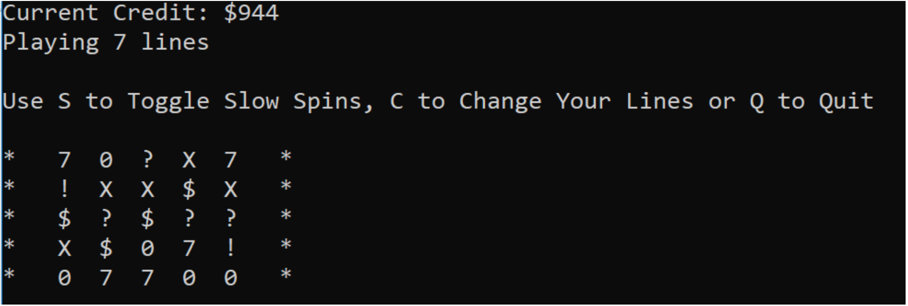
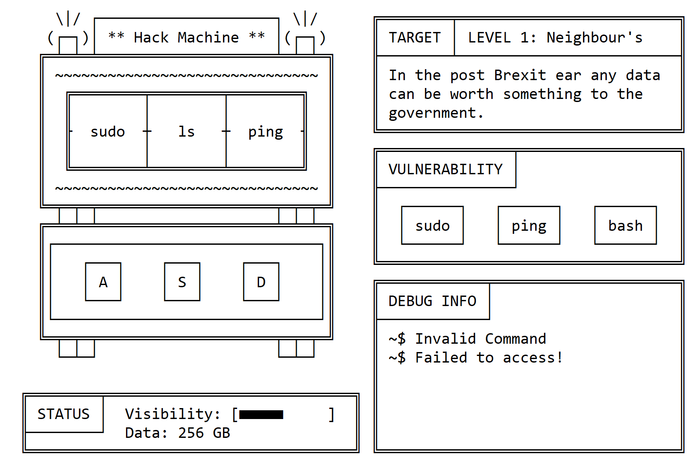
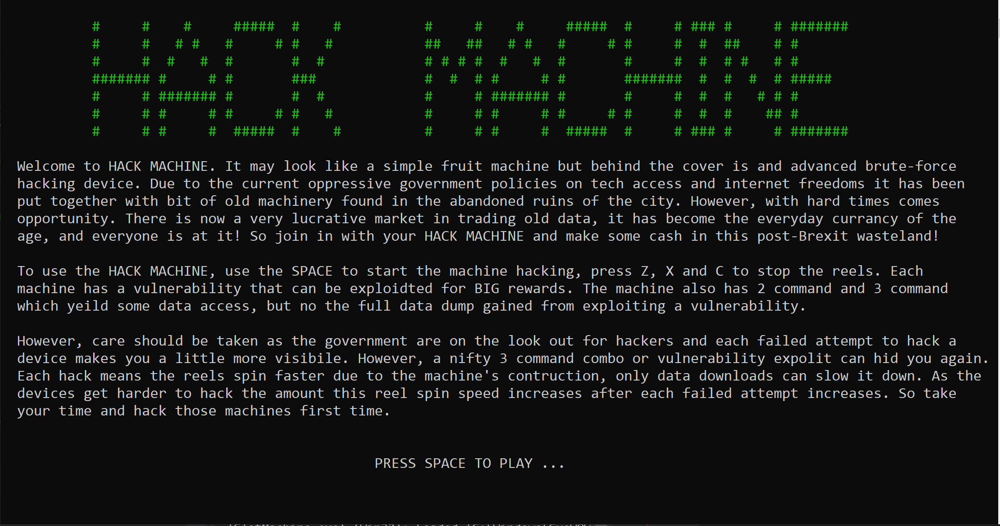
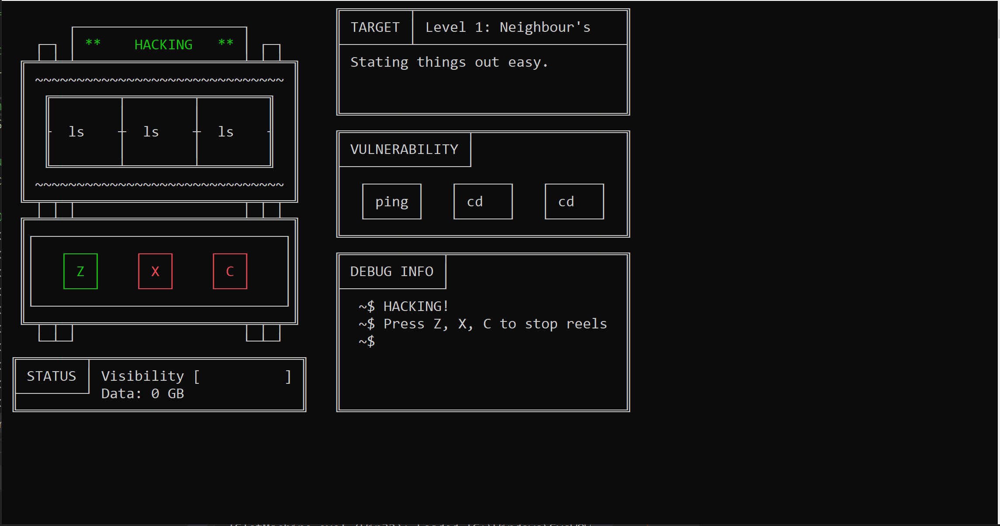
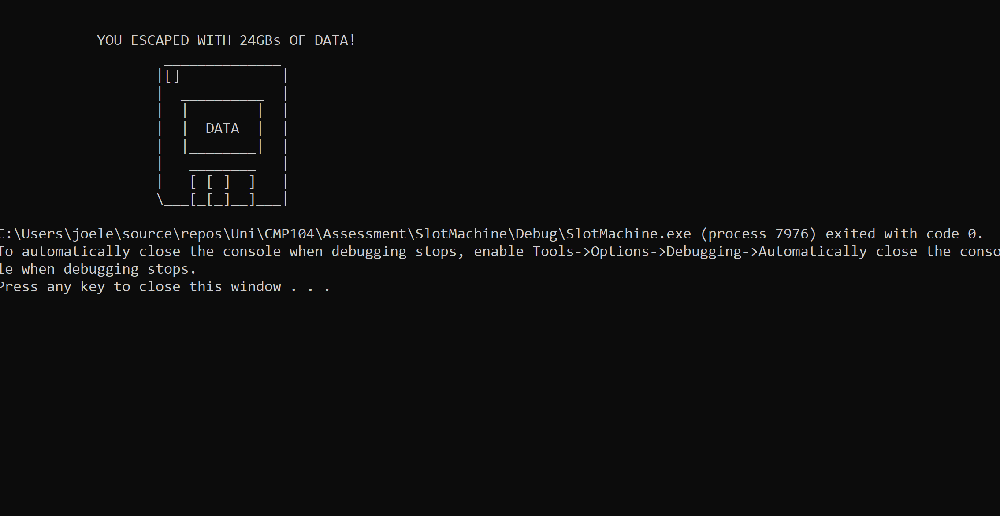
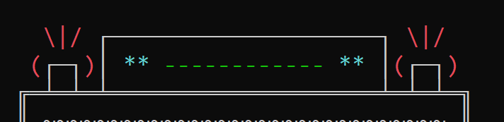
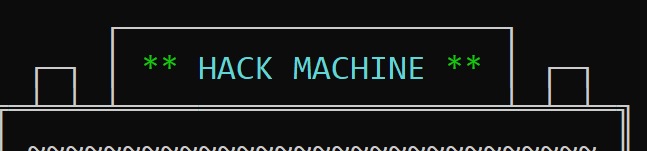
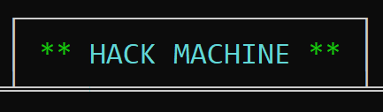
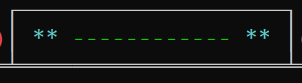
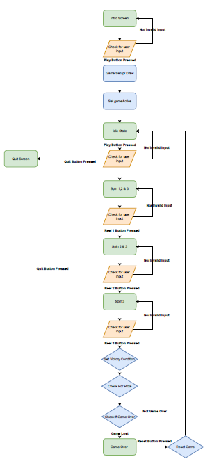

CMP 104 - Fruit Machine Assignment
==================================

Concept
=======

Overview
--------

Assignment is to create a fruit machine game in the console, which the user can play for prizes. The minimum functionality is shown below:
* 3 Columns (Reels)
* When the game beings all 3 reels will 'spin'
* User chooses when to stop reels 1, 2 & 3
* If 3 match big jackpot
* If 2 match smaller jackpot

Additional functionality can be added as needed. An example game from assessment sheet is shown below:



Concept For My Machine
----------------------

To bring the concept of the fruit machine and the course Ethical Hacking I thought it would be fun to make it a hacking themed fruit machine. The machine can be made to look cool with ASCII art. 

Fruit machine in this game is called the 'hack machine' and the reels will have console commands displayed on them. The prize/ currancy in this game is data, data stolen by successful hacks. Each time an invalid command is selected (i.e. 3 reels do not match) the player's visibility increases, once the visibility is at maximum the player is caught and the game is over. 

An added unique mechanic will be added to the game to add an extra challenge to game. Each time a spin is started a random 3 reel vulnerability is generated. This value will yeild the highest prize but the highest risk.

Concept of game:



Game Mechanics
--------------

### Reels
The reel hacking themed commands (a little cheesey):
1. cd
2. sudo
3. ls
4. bash
5. vim
6. ping
7. grep
8. ssh
9. echo

### Controls
The main game controls are:
* `Space` - Start Spins
* `Esc` - Quit Game
* `Z` - Stop Reel 1
* `X` - Stop Reel 2
* `C` - Stop Reel 3
* `R` - Restart Game 

### General Game Flow
A normal game would flow like below:
* Game intro and main screen displays with all the instruction games.
* `Space` to start game.
* Pints slot machine with animations.
* `Esc` to quit from this state back to main screen, `Space` starts reels spinning.
* All 3 reels keep spinning and vulnerability generated.
* Press `Z` key to stop Reel 1 spinning, other 2 reels keep spinning.
* Press `X` key to stop Reel 2 spinning, reel 3 keeps spinning.
* Press `C` key to stop Reel 3 Spinning. 
* Once all reels stopped values are checked against victory conditions.
* Data value increased if a winning score, visibility increases.
* Each spin attempt reel spinning speed increases, this is more drematic the higher the level. 
* Winning will also reduce the spin speed increase. 
* If Max visibility reached, game is over. 
* If game is over `R` can be pressed to restart the game.

### Game 

The game will be *State Machine* controlled. So, depending on the game's states it will enter several different state dependant loops. To escape that loop the game's state will be changed from within the loop. All the game state loops are contained in a game active loop. So once a loop is escaped it will run through main loop until next state loop is entered. 

The major game states are:

0. `IDLE` - Plays slot machine idle animation. (Lights and Name flashing, colours?)
1. `SPIN_REELS_123` - All 3 reels are continuously spinning until reel 1 key hit.
2. `SPIN_REELS_23` - Reels 2 & 3 continuously spinning until reel 2 key hit.
3. `SPIN_REEL_3` - Reel 3 continuously spinning until reel 3 key hit.
4. `ALL_REELS_STOPPED` - All reels have been stopped and victory state is checked. Game is then returned to `IDLE`.
5. `GAME_OVER` - Max visibility has been reached, game is over. Displays Game over animations. (Flashing lights, mean message?). Reset button is pressed to reset scores and return game to `IDLE`.
6. `QUIT` - Game is quit, display quit message/ close console?

These sates are stored in an enum class to make the states very obvious when used later in the code:

```cpp
	enum gameStates 
	{ 
		IDLE = 0,
		SPIN_REELS_123 = 1,
		SPIN_REELS_23 = 2,
		SPIN_REEL_3 = 3,
		ALL_REELS_STOPPED = 4,
		GAME_OVER = 5,
		QUIT = 6
	};
```
### Debug Info Window

The 'DEBUG INFO' window is used to display the game state, instructions and other little bits in a terminal prompt style to make it feel a little more hacker like. 

Main Game Loop Outline
-----------------------

A rough plan of the main game loop

* While `gameActive`
	* Select Action Dependant on `gameState`.
		* Idle State
			* Loop Animation
		* Spin State
			* Spin All
			* Spin 2 & 3
			* Spin 3
		* Game Over State
* End of While

Game
====

Overview
--------

The fruit machine game is a hacking themed game. See below screenshots for Intro Scree, Game Screen and Quit Screen:










Includes
---------

```cpp
#include <iostream> // For Console i/o
#include <fcntl.h> // To set 16 encoding
#include <io.h> // Used to get _setmode()
#include <conio.h> // For reading key presses
#include <stdio.h> // Used with above.
#include <Windows.h> // To get access to console screen buffer etc.
#include <cstdlib> // Used for Random Number Generation
#include <ctime> // Date and time info (Used as random Number Seed)
```

General Notes
-------------

Due to the use of Unicode character set in this game the file mode has been set to translate the `stdout` to **UTF-16** so all all char, strings and output should use wide characters, standard UTF-8 characters may not display correctly to console. 

Globals
--------

### Console
`cursor_info` - Stores console cursor information

`hconsole` - Stores console handle information

`DEFAULT_TEXT_COLOUR` - Console's default text colour (White by default)

### Game
`DATA_PRIZE_2` - Data prize for 2 reels (3 by default)

`DATA_PRIZE_3` - Data prize for 2 reels (9 by default)

`DATA_PRIZE_VUN` - Data prize for vulnerability exploit (12 by default)

`SPIN_SPEED_PRIZE_2` - Spin speed reduction for 2 reels in ms (50 by defualt)

`SPIN_SPEED_PRIZE_3` - Spin speed reduction for 3 reels in ms (75 by defualt)

`START_SPIN_SPEED` - Spin speed at the start of game in ms (500 by default)

`DIFFICULTY` - Spin speed increase after each spin, this happens regardless of win or loose. In ms (50 by default).

`gameStates` - Enum with all possible game states.
```cpp
const enum gameStates {
	IDLE = 0,
	SPIN_REELS_123 = 1,
	SPIN_REELS_23 = 2,
	SPIN_REEL_3 = 3,
	ALL_REELS_STOPPED = 4,
	GAME_OVER = 5,
	QUIT = 6
};

```

### Controls
`REEL1_KEY` - Key to stop Reel 1 spinning ('Z' by default)

`REEL2_KEY` - Key to stop Reel 2 spinning ('X' by default)

`REEL3_KEY` - Key to stop Reel 3 spinning ('C' by default)

`RESET_KEY` - Key to reset game ('R' by default)

`PLAY_KEY` - Key to start game and start spins (`SPACE` by default)

`QUIT_KEY` - Key to quit game from `IDLE` (`Esc` by default)

### Reels
`REEL_LENGTH` - Defines the number of vaules in reels (9 ny default)

`REEL_VALUES` - Stores all the possible reel values.
```cpp
const wstring REEL_VALUES[REEL_LENGTH] = { 
	L"cd  ",
	L"sudo",
	L"ls  ",
	L"bash",
	L"vim ",
	L"ping",
	L"grep",
	L"ssh ",
	L"echo"
};
```

### Code

```cpp
// Console Globals
CONSOLE_CURSOR_INFO cursor_info;
HANDLE hconsole;
const int DEFAULT_TEXT_COLOR = 7; // Default Console Text Colour;

// Game Consts
const int DATA_PRIZE_2 = 3; // Data Prize For 2 Reels
const int DATA_PRIZE_3 = 9; // Data Prize For 3 Reels
const int DATA_PRIZE_VUN = 12; // Data Prize Vun
const int SPIN_SPEED_PRIZE_2 = 50;
const int SPIN_SPEED_PRIZE_3 = 75;
const int START_SPIN_SPEED = 350;
const enum gameStates {
	IDLE = 0,
	SPIN_REELS_123 = 1,
	SPIN_REELS_23 = 2,
	SPIN_REEL_3 = 3,
	ALL_REELS_STOPPED = 4,
	GAME_OVER = 5,
	QUIT = 6
};

// Game Controls
const char REEL1_KEY = 'Z';
const char REEL2_KEY = 'X';
const char REEL3_KEY = 'C';
const char RESET_KEY = 'R';
const char PLAY_KEY = ' ';
const char QUIT_KEY = 27; // Esc Key.

// Reels
const int REEL_LENGTH = 9;
const wstring REEL_VALUES[REEL_LENGTH] = { 
	L"cd  ",
	L"sudo",
	L"ls  ",
	L"bash",
	L"vim ",
	L"ping",
	L"grep",
	L"ssh ",
	L"echo"
};
```

**NOTE: Due to reel box size, all reel values(commands) must be 4 characters long, if they are shorter then this right-hand padding should be added to keep all reel strings to 4 characters.**

Functions
=========

Game Drawing Functions
----------------------

### GraphicsSetup()

This function is used to set up the console grapics. This includes setting up `hconsole` handle to allow console I/O, cursor visibility and console character mode. 

```cpp
void GraphicsSetup()
{
	// Enables File Translation to U16 Text so console can display unicode
	// makes stout print in U16, so all chars and string will need to be 16-bit,
	// i.e wchar, wstring.

	// Return assigned to result to prevent complier warning, result not used. 
	bool result = _setmode(_fileno(stdout), _O_U16TEXT);


	// 	CONOUT$ file name selected to open handle to current console active screen
	// buffer. 
	hconsole = CreateFile(TEXT("CONOUT$"), GENERIC_WRITE | GENERIC_READ,
		FILE_SHARE_READ | FILE_SHARE_WRITE, 0L, OPEN_EXISTING, 
		FILE_ATTRIBUTE_NORMAL, 0L);

	// Get Cursor Info
	GetConsoleCursorInfo(hconsole, &cursor_info);

	cursor_info.bVisible = false; // Set cursor visability to false

	// Set Cursor Info
	SetConsoleCursorInfo(hconsole, &cursor_info);
}
```

`_setmode` used to translate the `stdout` from the default **UTF-8** to **UTF-16** to allow the use of Unicode characters in console. This does mean that all `stdout` chars and strings must be wide values (`wChar` and `wString`). It is assigned to `result` just to capture the return from function, this is not used in this function and is to avoid compilation error. It could be used to provide debug output to show if setting mode was successsful.

`CreateFile` is used to populate the hconsole handle with the current console's I/O information. The file name `CONOUT$` is used to select the current console's active screen buffer for I/O. 

The other parameters in `CreateFile` are, information taken from [Microsoft Dev Center](https://docs.microsoft.com/en-gb/windows/win32/api/fileapi/nf-fileapi-createfilea?redirectedfrom=MSDN).

```cpp
CreateFile(FileName, DesiredAccess, ShareMode, SecurityAtt,
	CreationDispostion, FlagsAndAttributes, TemplateFile);
```

So `hconsole` is set to console's active screen buffer, with read & write permissions (as standard in docs), with file share read write (again default from docs), 0 dWord security attribute (`0L` is used to ensure long int used to match dWord length), only opens if the file exists (default in doc, in this case if the console is not open then the screen buffer wouldn't exist), file is set to normal as it has no attributes, No templates used. 

This function also sets the console cursor visibility to `false` to prevent it displaying with the below:

```cpp
	// Get Cursor Info
	GetConsoleCursorInfo(hconsole, &cursor_info);

	cursor_info.bVisible = false; // Set cursor visability to false

	// Set Cursor Info
	SetConsoleCursorInfo(hconsole, &cursor_info);
```

### IntroScreen()

The `IntroScreen` function prints the introduction screen for the game. This screen has game title, story and instructions. 

```cpp
void IntroScreen()
{
	wstring gameTitle[7] = {
		L" #     #    #     #####  #    #          #     #    #     #####  #     # ### #     # #######",
		L" #     #   # #   #     # #   #           ##   ##   # #   #     # #     #  #  ##    # #      ",
		L" #     #  #   #  #       #  #            # # # #  #   #  #       #     #  #  # #   # #      ",
		L" ####### #     # #       ###             #  #  # #     # #       #######  #  #  #  # #####  ",
		L" #     # ####### #       #  #            #     # ####### #       #     #  #  #   # # #      ",
		L" #     # #     # #     # #   #           #     # #     # #     # #     #  #  #    ## #      ",
		L" #     # #     #  #####  #    #          #     # #     #  #####  #     # ### #     # #######",
	};

	// Print Title
	SetConsoleTextAttribute(hconsole, 10); // Set Name Light Green

	for(int i = 0; i < 7; i++)
	{
		short pos = 1 + i;

		SetConsoleCursorPosition(hconsole, { 10, pos});
		wcout << gameTitle[i];
	}

	SetConsoleTextAttribute(hconsole, DEFAULT_TEXT_COLOR); // Set Console Text Color to Default

	wcout << endl;
	wcout << endl;
	wcout << L"  Welcome to HACK MACHINE. It may look like a simple fruit machine but behind the cover is and advanced brute-force" << endl;
	wcout << L"  hacking device. Due to the current oppressive government policies on tech access and internet freedoms it has been" << endl;
	wcout << L"  put together with bit of old machinery found in the abandoned ruins of the city. However, with hard times comes " << endl;
	wcout << L"  opportunity. There is now a very lucrative market in trading old data, it has become the everyday currency of the" << endl;
	wcout << L"  age, and everyone is at it! So join in with your HACK MACHINE and make some cash in this post-Brexit wasteland!" << endl;
	wcout << endl;
	wcout << L"  To use the HACK MACHINE, use the SPACE to start the machine hacking, press Z, X and C to stop the reels. Each" << endl;
	wcout << L"  machine has a vulnerability that can be exploited for BIG rewards. The machine also has 2 command and 3 command" << endl;
	wcout << L"  which yield some data access, but no the full data dump gained from exploiting a vulnerability." << endl;
	wcout << endl;
	wcout << L"  However, care should be taken as the government are on the lookout for hackers and each failed attempt to hack a" << endl;
	wcout << L"  device makes you a little more visible. However, a nifty 3 command combo or vulnerability exploit can hide you again." << endl;
	wcout << L"  Each hack means the reels spin faster due to the machine's construction, only data downloads can slow it down. As the " << endl;
	wcout << L"  devices get harder to hack the amount this reel spin speed increases after each failed attempt increases. So, take" << endl;
	wcout << L"  your time and hack those machines first time." << endl;
	wcout << endl;
	wcout << endl;
	wcout << L"                                             PRESS SPACE TO PLAY ... " << endl;
}
```

### QuitScreen(int score)

The `QuitScreen` function prints the quit screen, this screen displays a floppy disc image and the `score` the player reached when the game was quit.

```cpp
void QuitScreen(int score)
{
	wcout << endl;
	wcout << endl;
	wcout << L"            YOU ESCAPED WITH " << score << "GBs OF DATA!" << endl;
	wcout << L"                    ______________" << endl;
	wcout << L"                   |[]            |" << endl;
	wcout << L"                   |  __________  |" << endl;
	wcout << L"                   |  |        |  |" << endl;
	wcout << L"                   |  |  DATA  |  |" << endl;
	wcout << L"                   |  |________|  |" << endl;
	wcout << L"                   |   ________   |" << endl;
	wcout << L"                   |   [ [ ]  ]   |" << endl;
	wcout << L"                   \\___[_[_]__]___|" << endl;
}
```
### DrawSlotMachine()

The `DrawSlotMachine` function draws the outline of the slotmachine to the console. With a top-left position of (**1,1**).

```cpp
SetConsoleCursorPosition(hconsole, {1,1});

	wcout << L"   \\|/ ┌────────────────────┐ \\|/  " << endl;
	wcout << L"   (┌─┐)│                    │(┌─┐)" << endl;
	wcout << L"  ╔═╧═╧═╧════════════════════╧═╧═╧═╗" << endl;
	wcout << L"  ║ ~~~~~~~~~~~~~~~~~~~~~~~~~~~~~~ ║ " << endl;
	wcout << L"  ║  ╔════════╤════════╤════════╗  ║" << endl;
	wcout << L"  ║  ║        │        │        ║  ║" << endl;
	wcout << L"  ║  ╟─      ─┼─      ─┼─      ─╢  ║" << endl;
	wcout << L"  ║  ║        │        │        ║  ║" << endl;
	wcout << L"  ║  ╚════════╧════════╧════════╝  ║" << endl;
	wcout << L"  ║ ~~~~~~~~~~~~~~~~~~~~~~~~~~~~~~ ║" << endl;
	wcout << L"  ╚═╤═╤═╤════════════════════╤═╤═╤═╝" << endl;
	wcout << L"  ╔═╧═╧═╧════════════════════╧═╧═╧═╗" << endl;
	wcout << L"  ║┌──────────────────────────────┐║" << endl;
	wcout << L"  ║│                              │║" << endl;
	wcout << L"  ║│                              │║" << endl;
	wcout << L"  ║│                              │║" << endl;
	wcout << L"  ║└──────────────────────────────┘║" << endl;
	wcout << L"  ╚═╤═╤═╤════════════════════╤═╤═╤═╝" << endl;
	wcout << L"    └─┴─┘                    └─┴─┘  " << endl;
```

### DrawStatusBox()

The `DrawStatusBox` function draws the outline of the status box below the slotmachine. This status box displays players score (data) and visibility. It has a top-left position of (**0,20**).

```cpp
	SetConsoleCursorPosition(hconsole, { 0,20 });

	wcout << L" ╔════════╤═════════════════════════╗" << endl;
	wcout << L" ║ STATUS │ Visibility [          ] ║" << endl;
	wcout << L" ╟────────┘ Data: 0 GB              ║" << endl;
	wcout << L" ╚══════════════════════════════════╝" << endl;
```

### DrawTargetBox()

The `DrawTargetBox` function draws target box. This box is used to display level name and target description. It has a top-left position of (**40,0**). 

```cpp
void DrawTargetBox()
{
	wstring targetBox[7] = {
		L"╔════════╤═════════════════════════╗",
		L"║ TARGET │                         ║",
		L"╟────────┴─────────────────────────╢",
		L"║                                  ║",
		L"║                                  ║",
		L"║                                  ║",
		L"╚══════════════════════════════════╝"
	};

	for (int i = 0; i < 7; i++)
	{
		short pos = 0 + i;

		SetConsoleCursorPosition(hconsole, { 40, pos});

		wcout << targetBox[i];
	}
}
```

### DrawVunBox()

The `DrawVunBox` draws the box that will be used to display the randomly generated vulnerability values for each spin. It has a top-left position of (**40,7**).

```cpp
void DrawVunBox()
{
	wstring vunBox[7] = {
	L"╔═══════════════╤══════════════════╗",
	L"║ VULNERABILITY │                  ║",
	L"╟───────────────┘                  ║",
	L"║  ┌──────┐   ┌──────┐   ┌──────┐  ║",
	L"║  │ ---- │   │ ---- │   │ ---- │  ║",
	L"║  └──────┘   └──────┘   └──────┘  ║",
	L"╚══════════════════════════════════╝"
	};

	for (int i = 0; i < 7; i++)
	{
		short pos = 7 + i;

		SetConsoleCursorPosition(hconsole, { 40, pos });

		wcout << vunBox[i];
	}
}
```
### DrawReelKey(int reel, bool active)

The `DrawReelKey` function takes in *reel* and *active*. If the value of *reel* is a valid reel number the reel key for that reel will be set to *active*. If an invalid reel number is provided a debug mesage will be printed.

```cpp
void DrawReelKey(int reel, bool active)
{
	switch (reel)
	{
		case 1:
			DrawReel1Key(active);
			break;
		case 2:
			DrawReel2Key(active);
			break;
		case 3:
			DrawReel3Key(active);
			break;
		default:
			OutputDebugString("DEBUG: Invalid reel number selected.");
			break;
	}
}
```

### DrawReel1Key(bool active)

The `DrawReel1Key` function draws the reel 1 key button indication under reel 1, it is red for inactive and green for active. Use by the `DrawReelKey` function.

```cpp
void DrawReel1Key(bool active) 
{
	wstring reel1Key[3] = {
	L"┌───┐",
	L"│ Z │",
	L"└───┘"
	};

	if (active) 
	{
		SetConsoleTextAttribute(hconsole, 10); // Set Name Light Green
	}
	else
	{
		SetConsoleTextAttribute(hconsole, 12); // Set Lights Red
	}
	   	  
	for (int i = 0; i < 3; i++)
	{
		short pos = 14 + i;
		SetConsoleCursorPosition(hconsole, { 7, pos });
		wcout << reel1Key[i];
	}

	SetConsoleTextAttribute(hconsole, DEFAULT_TEXT_COLOR); // Set Console Text Color to Default
}

```
### DrawReel2Key(bool active)

The `DrawReel2Key` function draws the reel 2 key button indication under reel 2, it is red for inactive and green for active. Use by the `DrawReelKey` function.

```cpp
void DrawReel2Key(bool active)
{
	wstring reel2Key[3] = {
	L"┌───┐",
	L"│ X │",
	L"└───┘"
	};

	if (active)
	{
		SetConsoleTextAttribute(hconsole, 10); // Set Name Light Green
	}
	else
	{
		SetConsoleTextAttribute(hconsole, 12); // Set Lights Red
	}

	for (int i = 0; i < 3; i++)
	{
		short pos = 14 + i;
		SetConsoleCursorPosition(hconsole, { 16, pos });
		wcout << reel2Key[i];
	}

	SetConsoleTextAttribute(hconsole, DEFAULT_TEXT_COLOR); // Set Console Text Color to Default
}
```

### DrawReel3Key(bool active)

The `DrawReel3Key` function draws the reel 3 key button indication under reel 3, it is red for inactive and green for active. Use by the `DrawReelKey` function.

```cpp
void DrawReel3Key(bool active)
{
	wstring reel3Key[3] = {
	L"┌───┐",
	L"│ C │",
	L"└───┘"
	};

	if (active)
	{
		SetConsoleTextAttribute(hconsole, 10); // Set Name Light Green
	}
	else
	{
		SetConsoleTextAttribute(hconsole, 12); // Set Lights Red
	}

	for (int i = 0; i < 3; i++)
	{
		short pos = 14 + i;
		SetConsoleCursorPosition(hconsole, { 25, pos });
		wcout << reel3Key[i];
	}

	SetConsoleTextAttribute(hconsole, DEFAULT_TEXT_COLOR); // Set Console Text Color to Default
}
```

### DrawDebugInfo()

The `DrawDebugInfo` function draws the mock debug info box that is used to display game instructions, comments, and victory state. It has a top-left position of (**40,14**).

```cpp
void DrawDebugInfo()
{
	wstring debugInfoBox[10] = {
	L"╔════════════╤═════════════════════╗",
	L"║ DEBUG INFO │                     ║",
	L"╟────────────┘                     ║",
	L"║                                  ║",
	L"║                                  ║",
	L"║                                  ║",
	L"║                                  ║",
	L"║                                  ║",
	L"║                                  ║",
	L"╚══════════════════════════════════╝"
	};

	for (int i = 0; i < 10; i++)
	{
		short pos = 14 + i;

		SetConsoleCursorPosition(hconsole, { 40, pos });

		wcout << debugInfoBox[i];
	}
}
```

Game Print Functions
--------------------

### PrintMachineBanner(wstring message, bool isWarning)

The `PrintMachineBanner` displays `message` in the fruit machine's banner on the top of the machine. If `isWarning` is `true` this message will be displayed in red, if `false` it will be displayed in green. The maximum message length is **12** characters.

```cpp
void PrintMachineBanner(wstring message, bool isWarning)
{
	if (message.length() <= 12) 
	{
		if (isWarning)
		{
			SetConsoleTextAttribute(hconsole, 12); // Set Lights Red
		}

		else
		{
			SetConsoleTextAttribute(hconsole, 10); // Set Name Light Green
		}

		SetConsoleCursorPosition(hconsole, { 13,2 });

		wcout << message;

		SetConsoleTextAttribute(hconsole, DEFAULT_TEXT_COLOR); // Set Console Text Color to Default
	}

	else
	{
		OutputDebugString("DEBUG: MachineBanner message too long");
	}
}
```

### PrintReel(int reelNumber, int pos)

The `PrintReel` function prints the string stored in `REEL_VALUES[pos]` to the reel identified by `reelNumber`. For this game it can accept `reelNumber` 0, 1 and 2. It will not accept a value out of this range as there are only 3 reels on the slot machine. In addition to printing the value for the reel it will also print the previous reel value above the current one and the next one below the current value to simpuate how the reels spin on a real fruit machine. If an invalid reel number is selected it will output a debug string.

```cpp
void PrintReel(int reelNumber, int pos)
{
	int previousReel = PreviousReelValue(pos);
	int nextReel = NextReelValue(pos);

	if (reelNumber > 0 && reelNumber <= 3)
	{
		if (reelNumber == 1)
		{
			SetConsoleCursorPosition(hconsole, { 8,6 });
			wcout << REEL_VALUES[previousReel];
			SetConsoleCursorPosition(hconsole, { 8,7 });
			wcout << REEL_VALUES[pos];
			SetConsoleCursorPosition(hconsole, { 8,8 });
			wcout << REEL_VALUES[nextReel];
		}

		else if (reelNumber == 2)
		{
			SetConsoleCursorPosition(hconsole, { 17,6 });
			wcout << REEL_VALUES[previousReel];
			SetConsoleCursorPosition(hconsole, { 17,7 });
			wcout << REEL_VALUES[pos];
			SetConsoleCursorPosition(hconsole, { 17,8 });
			wcout << REEL_VALUES[nextReel];
		}
		else if (reelNumber == 3)
		{
			SetConsoleCursorPosition(hconsole, { 26,6 });
			wcout << REEL_VALUES[previousReel];
			SetConsoleCursorPosition(hconsole, { 26,7 });
			wcout << REEL_VALUES[pos];
			SetConsoleCursorPosition(hconsole, { 26,8 });
			wcout << REEL_VALUES[nextReel];
		}
	}
	else 
	{
		OutputDebugString("DEBUG: reelNumberValue out of range. It must be between 1-3.");
	}
}
```

### PrintVunReel()

THe `PrintVunReel` function prints the value of the `REEL_VALUES` at index `pos` to the box for `reel`. It then saves the index of pos to `reelPosStore` so it can be used to work out if the reels match. 

```cpp
void PrintVunReel(int reel, int pos, int& rReelPosStore)
{
	switch (reel)
	{
	case 1:
		SetConsoleCursorPosition(hconsole, { 45 , 11 });
		break;

	case 2: 
		SetConsoleCursorPosition(hconsole, { 56 , 11 });
		break;

	case 3:
		SetConsoleCursorPosition(hconsole, { 67 , 11 });
		break;

	default:
		OutputDebugString("DEBUG: VunReel number out of range.");
		break;
	}

	// Print
	wcout << REEL_VALUES[pos];

	// Store
	rReelPosStore = pos;
}
```

### PrintDebugInfoMessage(wString messageLine1, wString messageLine2, wstring messageLine 3)

The `PrintDebugInfoMessage` prints the game's fake debug info to the Debug Info Box to display instructions and information on the gameplay. It take in three strings and displays them on three separate lines. 

```cpp
void PrintDebugInfoMessage(wstring messageLine1, wstring messageLine2, wstring messageLine3)
{
	SetConsoleCursorPosition(hconsole, { 43, 17 });
	wcout << "~$ " << messageLine1;

	SetConsoleCursorPosition(hconsole, { 43, 18 });
	wcout << "~$ " << messageLine2;

	SetConsoleCursorPosition(hconsole, { 43, 19 });
	wcout << "~$ " << messageLine3;
}
```

### ClearDebugInfoMessage()

The `ClearDebugInfoMessage` function clears the three Debug Info Box lines by writing spaces over the whole lines in the box. 

```cpp
void ClearDebugInfoMessage()
{
	PrintDebugInfoMessage(L"                           ", L"                           ", L"                           ");
}
```

### PrintData(int dataScore)

The `PrintData` function displays the `dataScore` value in the Status Box and adds the data **GB** unit. 

```cpp
void PrintData(int dataScore) 
{
	SetConsoleCursorPosition(hconsole, { 18,22 });
	wcout << dataScore << "         ";

	SetConsoleCursorPosition(hconsole, { 18,22 });
	wcout << dataScore << " GB";
}
```

### PrintVisibility(int visibilityScore)

The `PrintVisibility` takes in the `visibilityScore` and displays it as a bar in the Status Box. This bar is **RED** by default.

```cpp
void PrintVisibility(int visibilityScore)
{
	SetConsoleCursorPosition(hconsole, { 24,21 });
	wcout << L"          ";

	SetConsoleCursorPosition(hconsole, { 24,21 });
	SetConsoleTextAttribute(hconsole, 12); // Set bar Red

	for (int i = 0; i < visibilityScore; i++)
	{
		wcout << L"■";
	}

	SetConsoleTextAttribute(hconsole, DEFAULT_TEXT_COLOR); // Set Console Text Color to Default
}
```

### PrintLevelInfo(int levelValue)

The `PrintLevelInfo` function takes in the current level number, if it is within the number of levels in the game, **6** levels at this time. It will display the level name 'Target' and a small description. The level names are stored in the `levelNames` array and the descriptions in the `levelDescriptions` array. The relevent level information is printed inside the *Target Box*. If a level value outside the valid level rage is input then a debug message will be printed. The possible levels are shown in the below table:

| Level |   Level Name  |       Level Description       |
|:-----:|:-------------:|:-----------------------------:|
|   1   | Neighbour's   | Stating things out easy.      |
|   2   | Small Office  | Upping the stakes?            |
|   3   | Big Office    | Now the real game begins!     |
|   4   | Small Website | You're no script kiddie now!. |
|   5   | Large Website | You're aiming big now         |
|   6   | Government    | AHHH! You're crazy!           |

```cpp
void PrintLevelInfo(int levelValue)
{
	if (levelValue > 0 && levelValue <= 6)
	{
		wstring levelNames[6] = {
			L"Level 1: Neighbour's",
			L"Level 2: Small Office",
			L"Level 3: Big Office",
			L"Level 4: Small Website",
			L"Level 5: Large Website",
			L"Level 6: Government"
		};

		wstring levelDescriptions[6] = {
			L"Stating things out easy.",
			L"Upping the stakes?",
			L"Now the real game begins!",
			L"You're no script kiddie now!",
			L"You're aiming big now!",
			L"AHHH! You're crazy!"
		};


		// Print Level Name
		SetConsoleCursorPosition(hconsole, { 51 , 1 });
		wcout << L"                        ";

		SetConsoleCursorPosition(hconsole, { 51 , 1 });
		wcout << levelNames[(levelValue - 1)];

		// Print Level Description
		SetConsoleCursorPosition(hconsole, { 42 , 3 });
		wcout << L"                                ";

		SetConsoleCursorPosition(hconsole, { 42 , 3 });
		wcout << levelDescriptions[(levelValue -1)];
	}

	else 
	{
		OutputDebugString("DEBUG: Invalid Level Selected");
	}	
}
```

Game Animation Functions
------------------------

### ToogleSlotMachineLights(bool& rStatus)

```cpp
void ToggleSlotMachineLights(bool& rStatus)
{

	if (status)
	{
		SetConsoleTextAttribute(hconsole, 12); // Set Lights Red

		// Light 1 top
		SetConsoleCursorPosition(hconsole, { 4, 1 });
		wcout << "\\|/";

		// Light 1 Left
		SetConsoleCursorPosition(hconsole, { 3,2 });
		wcout << "(";

		// Light 1 Right
		SetConsoleCursorPosition(hconsole, { 7,2 });
		wcout << ")";

		// Light 2 top
		SetConsoleCursorPosition(hconsole, { 31, 1 });
		wcout << "\\|/";

		// Light 2 Left
		SetConsoleCursorPosition(hconsole, { 30,2 });
		wcout << "(";

		// Light 2 Right
		SetConsoleCursorPosition(hconsole, { 34,2 });
		wcout << ")";

		SetConsoleTextAttribute(hconsole, DEFAULT_TEXT_COLOR); // Set Console Text Color to Default

		status = false;
	}
	else
	{
		// Light 1 top
		SetConsoleCursorPosition(hconsole, { 4, 1 });
		wcout << "   ";

		// Light 1 Left
		SetConsoleCursorPosition(hconsole, { 3,2 });
		wcout << " ";

		// Light 1 Right
		SetConsoleCursorPosition(hconsole, { 7,2 });
		wcout << " ";

		// Light 2 top
		SetConsoleCursorPosition(hconsole, { 31, 1 });
		wcout << "   ";

		// Light 2 Left
		SetConsoleCursorPosition(hconsole, { 30,2 });
		wcout << " ";

		// Light 2 Right
		SetConsoleCursorPosition(hconsole, { 34,2 });
		wcout << " ";

		status = true;
	}
}
```

The `ToggleSlotMachineLights` toggles the slot machine's lights animation depending on if the status is `true` or `false`. It then toggles `rStatus` to swap animation each time it is called. Below shows the lighs in on and off states.





### ToggleMachineName(bool& rStatus)

```cpp
if (rStatus)
	{	
		SetConsoleCursorPosition(hconsole, { 13,2 });

		SetConsoleTextAttribute(hconsole, 11); // Set Name Light Cyan

		wcout << "HACK MACHINE";

		SetConsoleTextAttribute(hconsole, 10); // Set Name Light Green

		SetConsoleCursorPosition(hconsole, { 10,2 });

		wcout << "**";

		SetConsoleCursorPosition(hconsole, { 26,2 });

		wcout << "**";

		SetConsoleTextAttribute(hconsole, DEFAULT_TEXT_COLOR); // Set Console Text Color to Default

		status = false;
	}
	else
	{
		SetConsoleCursorPosition(hconsole, { 13,2 });

		SetConsoleTextAttribute(hconsole, 10); // Set Name Light Green

		wcout << "------------";

		SetConsoleTextAttribute(hconsole, 11); // Set Name Light Cyan

		SetConsoleCursorPosition(hconsole, { 10,2 });

		wcout << "**";

		SetConsoleCursorPosition(hconsole, { 26,2 });

		wcout << "**";

		SetConsoleTextAttribute(hconsole, DEFAULT_TEXT_COLOR); // Set Console Text Color to Default

		status = true;
	}	
}
```

The `ToggleMachineName` function displays the slot machine's name ans toggles if it is showing or not. In a similar way to the `ToggleSlotMachineLights`. Below images show the machine's name in both states. 





Game Mechanics Functions
------------------------

### VictoryState(int reel1, int reel2, int reel3, int vun1, int vun2, int,vun3)

The `VictoryState` takes in the 3 reel positions and the 3 randomly generated vulnarability reel positions and check if they meet one of the victory conditions. It returns an **int** to represent this `victoryState`. 

There are four victory states:

0. No Win, none of the three reels match
1. Vulnerability Win, the reels match vun values, all 3 in the correct order.
2. 2 Reel Win, two reel match each other.
3. 3 Reel Win, three reels match each other. 

```cpp
int VictoryState(int reel1, int reel2, int reel3, int vun1, int vun2, int vun3)
{
	int victoryState = 0; // 0 = no win, 1 = vulnarability, 2 = 2 reels, 3 = 3 reels

	if (reel1 == vun1 && reel2 == vun2 && reel3 == vun3)
	{
		victoryState = 1;
	}
	// 3 Reel Victory
	else if (reel1 == reel2 && reel1 == reel3)
	{
		victoryState = 3;
	}

	// 2 Reel Victory
	else if (reel1 == reel2 || reel2 == reel3 || reel1 == reel3)
	{
		victoryState = 2;
	}

	return victoryState;
}
```

### IncreaseVisibility(int& rVis)

The `IncreaseVisibility` function increases the value of `rVis` **1** until a value of **10** it will not increase the value higher then **10** wich is the maximum visibility value that can be displayed in Status Box visibility bar.

```cpp
void IncreaseVisibility(int& rVis) 
{
	if (rVis <= 10) 
	{
		rVis ++;
	}
}
```

### DecreaseVisibility(int& rVis)

The `DecreaseVisibility` function will decrease the value of `rVis` by **1** but it will not decrease the value below **0**.

```cpp
void DecreaseVisibility(int& rVis)
{
	if (rVis > 0)
	{
		rVis--;
	}
}
```

### ResetVisibility(int& rVis)

The `ResetVisibility` function resets the value of the visibility back to its start of game value, by default this is **0**.

```cpp
void ResetVisibility(int& rVis)
{
	rVis = 0;
}
```

### IncreaseData(int& rData, int ammount)

The `IncreaseData` increases the `rData` variable by `ammount`.

```cpp
void IncreaseData(int& rData, int ammount)
{
	rData += ammount;
}
```

### DecreaseData(int& rData, int ammount)

The `DecreaeData` decreases the `rData` variable by `ammount`. By will not reduce the score below **0**.

```cpp
void DecreaseData(int& rData, int ammount)
{
	if ((rData - ammount) >= 0)
	{
		rData -= ammount;
	}
}
```

### ResetData(int& rData)

The `ResetData` function resets the data to its start value.

```cpp
void ResetData(int& rData)
{
	rData = 0;
}
```

### IncreaseSpinSpeed(int& rSpinSpeed, int ammount)

The `IncreaseSpinSpeed` function increases the `rSpinSpeed` value by `ammount`, as the spin speed is the delay between printing each value in the reel this delay is reduced to increase the spin speed of reels. This value will be reduced to a miniumum value of **0**ms. 

```cpp
void IncreaseSpinSpeed(int& rSpinSpeed, int ammount)
{
	if ((rSpinSpeed - ammount) >= 0)
	{
		rSpinSpeed -= ammount;
	}
}
```

### DecreaseSpinSpeed(int& rSpinSpeed, int ammount)

The `DecreaseSpinSpeed` function deacreases the `rSpinSpeed` by `ammount` ms, to decrease the spin speed the delay is increased.

```cpp
void DecreaseSpinSpeed(int& rSpinSpeed, int ammount)
{
	rSpinSpeed += ammount;
}
```

### ResetSpinSpeed(int& rSpinSpeed)

The `ResetSpinSpeed` function resets the `rSpinSpeed` to its starting value `START_SPIN_SPEED` which by defualt is **500**ms.

```cpp
void ResetSpinSpeed(int& rSpinSpeed)
{
	rSpinSpeed = START_SPIN_SPEED;
}
```

### RandomReelPosition(int reelLength)

The `RandomReelPosition` function returns a randomly generated integer `randomPos` between **0** and `reelLength`. This function is used to randomly select vulnerability vaules.

```cpp
int RandomReelPosition(int reelLength) 
{
	int randomPos = 0;

	randomPos = rand() % reelLength;

	return randomPos;
}
```

### SelectLevel(int dataScore)

The `SelectLevel` function returns an integer based on the input parameter `dataScore`. The game starts on level **1** and progresses as indicated in the below table:

| Level |    Data Score  |
|:-----:|:--------------:|
|   1   |      0 - 9     |
|   2   |     10 - 24    |
|   3   |     24 - 39    |
|   4   |     40 - 54    |
|   5   |     55 - 69    |
|   6   |   70 or more   |

```cpp
int SelectLevel(int dataScore) 
{
	if (dataScore > 70)
	{
		return 6;
	}

	else if (dataScore > 55)
	{
		return 5;
	}

	else if (dataScore > 40)
	{
		return 4;
	}

	else if (dataScore > 25)
	{
		return 3;
	}

	else if (dataScore > 10)
	{
		return 2;
	}

	else
	{
		return 1;
	}
}
```

### SetDifficulty(int& rDifficulty, int level)

The `SetDifficulty` function sets the 'difficulty' of the game. In this game the difficulty refers to the ammount the spin speed will increase after each failed spin attempt in *ms*. It is calcuated using a very simple formula in the function shown in code snippet below:

```cpp
void SetDifficulty(int& rDifficulty, int level)
{
	rDifficulty = 50 * level;
}
```

### PreviousReelValue(int currentPos)

The `PreviousReelValue` function takes in the `currentPos` of the reel and displays the previous value in the reel, it will loop round the reel to do this after the position of **0**. 

```cpp
int PreviousReelValue(int currentPos)
{
	if ((currentPos - 1) >= 0)
	{
		return (currentPos - 1);
	}

	else
	{
		return (REEL_LENGTH - 1);
	}
}
```

### NextReelValue(int currentPos)

The `NextReelValue` function takes in the `currentPos` of the reel and displays the next value in the reel, it will loop round the reel to do this after the position of `REEL_LENGTH - 1`. 

```cpp
{
	if ((currentPos + 1) < REEL_LENGTH)
	{
		return (currentPos + 1);
	}

	else
	{
		return 0;
	}
}
```

Main Function
-------------

The `main` function holds the main game loop and handles the main game flow. The below game flow is shown below flow diagram:




```cpp
int main()
{
	// Animation Variables
	bool lightStatus = false;
	bool nameStatus = true;
	int lightSpeed = 1000;
	int spinSpeed = START_SPIN_SPEED;

	// Game Variables
	int gameActive = false; // Remain in game loop
	int gameState = 0; // Store game state
	int reel1StopPos = 0; // The position reel 1 has been stopped in
	int reel2StopPos = 0; // The position reel 2 has been stopped in
	int reel3StopPos = 0; // The position reel 3 has been stopped in
	int vunReel1 = 0; // Reel 1 vulnerability position
	int vunReel2 = 0; // Reel 2 vulnerability position
	int vunReel3 = 0; // Reel 3 vulnerability position
	int data = 0; // Data score
	int visibility = 0; // Visibility Level
	int level = 1; // Current level
	int difficulty = 50; // Ammount Reel Spin Speed Incrases in ms.
	


	// Game Setup
	srand(time(0)); // Use time as random number seed
	GraphicsSetup();

	// Intro
	IntroScreen();

	// Wait for user to press space to play game
	while (!gameActive)
	{
		if (_kbhit())
		{
			int key = _getch();

			if (key == PLAY_KEY)
			{
				gameActive = true;
			}
		}
	}

	system("CLS"); // Clear console screen


	// Game
	DrawSlotMachine();
	DrawStatusBox();
	DrawTargetBox();
	DrawVunBox();
	DrawDebugInfo();
	PrintData(data);
	PrintVisibility(visibility);
	DrawReel1Key(false);
	DrawReel2Key(false);
	DrawReel3Key(false);
	PrintDebugInfoMessage(L"Welcome to HACK MACHINE", L"Press SPACE to spin reels", L"Press Esc to quit");
	PrintLevelInfo(level);
	PrintReel(1, 0); // Set Reel 1 Initial Position
	PrintReel(2, 0); // Set Reel 2 Initial Position
	PrintReel(3, 0); // Set Reel 3 Initial Position


	// Main Game Loop
	while (gameActive)
	{
		// Idle State Loop
		while (gameState == gameStates::IDLE)
		{
			ToggleMachineName(nameStatus);

			ToggleSlotMachineLights(lightStatus);
			
			// Check for user input
			if (_kbhit())
			{
				int key = _getch();

				if (key == PLAY_KEY) 
				{
					gameState = gameStates::SPIN_REELS_123;
				}

				if (key == QUIT_KEY)
				{
					gameActive = false;
					gameState = gameStates::QUIT;
				}
			}

			Sleep(lightSpeed);
		}

		// Spin State Loop
		while (gameState > gameStates::IDLE && gameState <= gameStates::SPIN_REEL_3)
		{
			bool keepSpinning = true;

			// Vun
			PrintVunReel(1, RandomReelPosition(REEL_LENGTH), vunReel1);
			PrintVunReel(2, RandomReelPosition(REEL_LENGTH), vunReel2);
			PrintVunReel(3, RandomReelPosition(REEL_LENGTH), vunReel3);

			// Instructions
			ClearDebugInfoMessage();
			PrintDebugInfoMessage(L"HACKING!", L"Press Z, X, C to stop reels", L" ");

			// Banner
			PrintMachineBanner(L"   HACKING  ", false);

			// Spinning Animation
			while (keepSpinning)
			{
				for (int i = 0; i < REEL_LENGTH; i++)
				{
					// Reel 1
					if (gameState == gameStates::SPIN_REELS_123)
					{
						PrintReel(1, i);
						DrawReelKey(1, true);
					}

					// Reel 2
					if (gameState == gameStates::SPIN_REELS_123 || gameState == gameStates::SPIN_REELS_23)
					{
						PrintReel(2, i);

						if(gameState == gameStates::SPIN_REELS_23)
						{
							DrawReelKey(1, false);
							DrawReelKey(2, true);
							DrawReelKey(3, false);
						}
					}

					// Reel 3
					if (gameState > gameStates::IDLE && gameState <= gameStates::SPIN_REEL_3)
					{
						PrintReel(3, i);

						if (gameState == gameStates::SPIN_REEL_3)
						{
							DrawReelKey(1, false);
							DrawReelKey(2, false);
							DrawReelKey(3, true);
						}
					}

					// Check for user input
					if (_kbhit())
					{
						int key = towupper(_getch());

						if (key == REEL1_KEY && gameState == gameStates::SPIN_REELS_123)
						{
							reel1StopPos = i;
							gameState = gameStates::SPIN_REELS_23;
							break;
						}

						if (key == REEL2_KEY && gameState == gameStates::SPIN_REELS_23)
						{
							reel2StopPos = i;
							gameState = gameStates::SPIN_REEL_3;
							break;
						}

						if (key == REEL3_KEY && gameState == gameStates::SPIN_REEL_3)
						{
							keepSpinning = false;
							reel3StopPos = i;
							gameState = gameStates::ALL_REELS_STOPPED;
							DrawReelKey(3, false);
							break;
						}
					}

					Sleep(spinSpeed);
				}
			}

			IncreaseSpinSpeed(spinSpeed, difficulty); // Increase after each spin attempt

			// Check Visctory State
			switch (VictoryState(reel1StopPos, reel2StopPos, reel3StopPos, vunReel1, vunReel2, vunReel3))
			{
				// Vulnerability Exploited
				case 1:
					ClearDebugInfoMessage();
					PrintDebugInfoMessage(L"ACCESS GRANTED!", L"Vulnerability Exploited!", L"12GB of data downloaded.");
					IncreaseData(data, DATA_PRIZE_VUN);
					ResetVisibility(visibility);
					ResetSpinSpeed(spinSpeed);
					break;

				// 2 Reel Combo
				case 2:
					ClearDebugInfoMessage();
					PrintDebugInfoMessage(L"ACCESS GRANTED!", L"Two Command Combo", L"3GB of data downloaded.");
					IncreaseData(data, DATA_PRIZE_2);
					DecreaseSpinSpeed(spinSpeed, SPIN_SPEED_PRIZE_2);
					break;

				// 3 Reel Combo
				case 3:
					ClearDebugInfoMessage();
					PrintDebugInfoMessage(L"ACCESS GRANTED!", L"Three Command Combo", L"9GB of data downloaded.");
					IncreaseData(data, DATA_PRIZE_3);
					ResetVisibility(visibility);
					DecreaseSpinSpeed(spinSpeed, SPIN_SPEED_PRIZE_3);
					break;

				// No win condition
				default:
					ClearDebugInfoMessage();
					PrintDebugInfoMessage(L"ACCESS DENIED!", L"Invalid Command Entered", L"Visibility Increased...");
					IncreaseVisibility(visibility);
					break;
			}

			// Update Scores
			if (gameState != gameStates::IDLE && gameState != gameStates::GAME_OVER)
			{
				PrintData(data);

				// Check if Game is Over
				if (visibility <= 10)
				{
					PrintVisibility(visibility);
					gameState = gameStates::IDLE;

					// Check if level increases
					level = SelectLevel(data);

					// Update Level
					PrintLevelInfo(level);

					// Set difficulty using level
					SetDifficulty(difficulty, level);
				}
				else
				{
					// Game Over
					gameState = gameStates::GAME_OVER;
					ClearDebugInfoMessage();
					PrintDebugInfoMessage(L"GAME OVER!", L"Press R to replay game", L"Press Esc to quit");
					PrintMachineBanner(L" GAME OVER  ", true);
				}
			}

			// Game Over State
			while (gameState == gameStates::GAME_OVER)
			{
				ToggleSlotMachineLights(lightStatus);

				// Check for user input
				if (_kbhit())
				{
					int key = towupper(_getch());

					// Reset Game
					if (key == RESET_KEY)
					{
						gameState = gameStates::IDLE;						
						ResetData(data);
						ResetVisibility(visibility);
						ResetSpinSpeed(spinSpeed);
						PrintData(data);
						PrintVisibility(visibility);
						level = 1;
						PrintLevelInfo(level);
						PrintDebugInfoMessage(L"Welcome to HACK MACHINE", L"Press SPACE to spin reels", L"Press Esc to quit");
						break;
					}

					// Quit Game
					if (key == QUIT_KEY)
					{
						gameActive = false;
						gameState = gameStates::QUIT;
					}
				}

				Sleep(lightSpeed);
			}
		}
	}
	
	// Display Quit Screen
	system("CLS"); // Clear Console 
	QuitScreen(data);

	return 0; // Return zero for int main()
}
```


